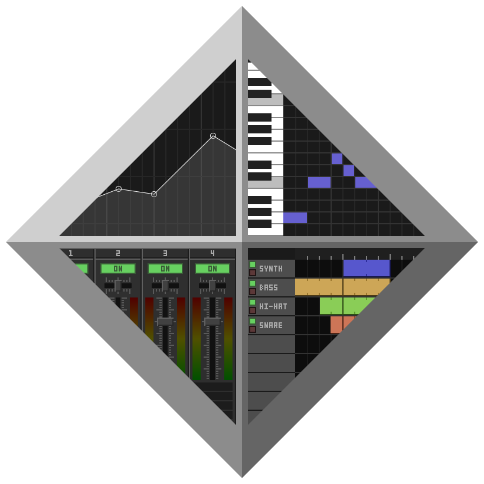

<div align="center">


# DawVert - The DAW ConVERTer
</div>

<p align="center">
    DawVert is a Project File Converter
</p>

<p align="center">
  <a title="Discord Server" href="https://discord.gg/SWkR6Z9pQC">
    
  </a>
</p>

## How to Use

```
python3 dawvert_cmd.py -i <input> -ot <output type> -o <output>

input pluginset: -ips
input type: -it 
input file: -i 
output type: -ot 
output file: -o

e.g: 
    python3 dawvert_cmd.py -i song.txt -ot flp -o out.flp

    python3 dawvert_cmd.py -it jummbox -i song.txt -ot flp -o out.flp

```

## Command Line Options
```
Song Number (used for Multi-Song inputs): 
--songnum <number>

Extra File (depends on plugin, .BNK for adlib_rol): 
--extrafile <file>

MultipleIndexed2Multiple:  
--mi2m--output-unused-nle           (Output Unused Patterns)

e.g: 
    python3 dawvert_cmd.py --soundfont "MuseScore_General.sf2" -it notessimo_v2 -i song.note -ot flp -o out.flp

    python3 dawvert_cmd.py --songnum 3 -it famistudio_txt -i "song.txt" -ot lmms -o out.mmp
```

## Required Libraries
```
varint
numpy
mido
lxml
chardet
av
beautifulsoup4
blackboxprotobuf
git+https://github.com/Perlence/rpp
```

[.dlls/.so](https://github.com/SatyrDiamond/DawVert-Libs)

## Required Libraries for UI
```
PyQt6
```

## Optional Libraries
```
xmodits_py - for extracting Impulse Tracker and FastTracker2 Samples
```

## (Some) Supported Outputs
[Full List...](docs/output_plugins.md)

| DataType | Short Name | Name |
| --- | --- | :--- |
| M-I | ```flp``` | FL Studio |
| R | ```lmms``` | LMMS |
| R | ```ableton``` | Ableton Live 11 |
| R | ```midi``` | MIDI |
| R | ```muse``` | MusE Sequencer |
| R | ```reaper``` | Reaper |
| R | ```dawproject``` | DawProject |

## (Some) Supported Inputs
[Full List...](docs/input_plugins.md)

| DataType | Short Name | Name | Ext | Autodetect | 
| --- | --- | :--- | :--- | :--- |
| R-M | ```midi``` | MIDI | ```.mid``` | ✔️ | 
| M-I | ```flp``` | FL Studio | ```.flp``` | ✔️ |
| R | ```ableton``` | Ableton Live 11 | ```.als``` | ✔️ |
| R | ```dawproject``` | DawProject | ```.dawproject``` | ✔️ |
| R | ```lmms``` | LMMS | ```.mmp```/```.mmpz``` | ✔️ |
| M | ```mod``` | ProTracker | ```.mod``` | ❌ | 
| M | ```xm``` | FastTracker 2 | ```.xm``` | ✔️ | 
| M | ```s3m``` | Scream Tracker 3 | ```.s3m``` | ✔️ | 
| M | ```it``` | Impulse Tracker | ```.it``` | ✔️ | 
| M | ```umx``` | Unreal Music Package  | ```.umx``` | ✔️ | 
| R | ```orgyana``` | Orgyana/OrgMaker | ```.org``` | ✔️ |
| M | ```ptcop``` | PxTone | ```.ptcop``` | ✔️ |
| M-S | ```serato``` | Serato Studio | ```.ssp``` | ✔️ |
| M-I | ```jummbox``` | Beepbox/Jummbox | ```.json``` | ❌ | 
| M-I | ```famistudio_txt``` | FamiStudio Text | ```.txt``` | ❌ | 

## VST Plugins
[Full List...](docs/vsts.md)

## Mirrors
[GitHub](https://github.com/SatyrDiamond/DawVert)

[Gitlab](https://gitlab.com/SatyrDiamond/DawVert)

[Codeberg](https://codeberg.org/SatyrDiamond/DawVert)
